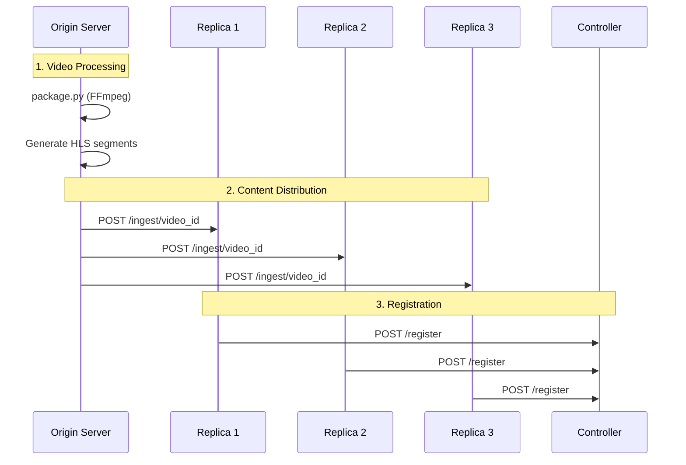
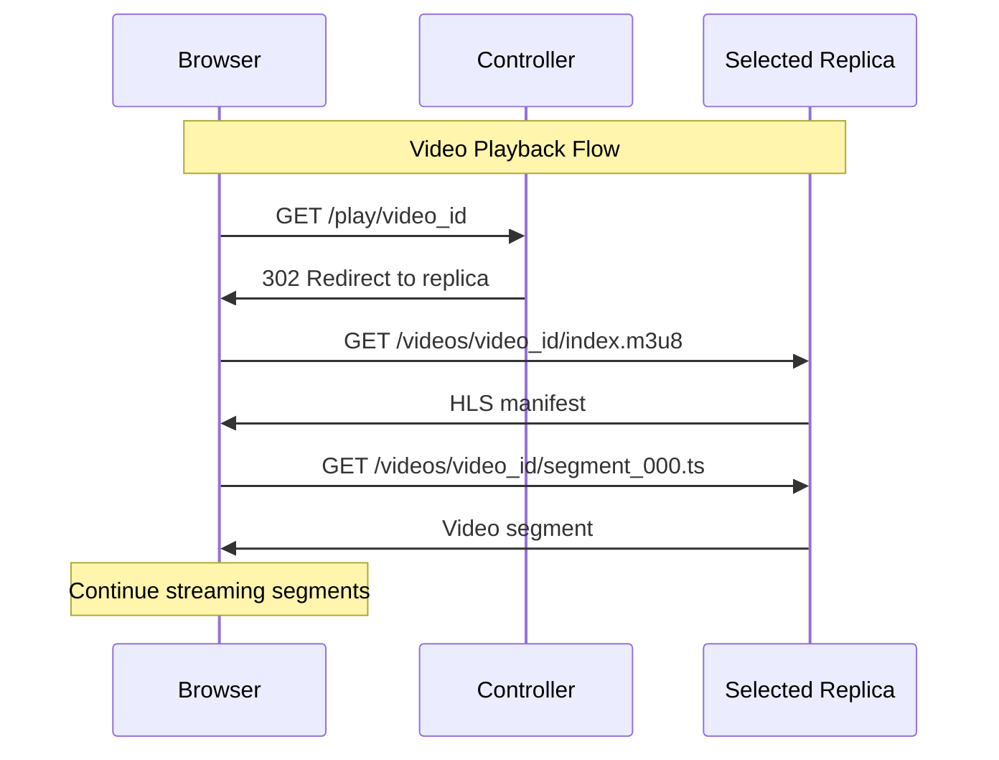

# CDN Network - System Architecture Documentation

## Table of Contents
1. [System Overview](#system-overview)
2. [Architecture Diagram](#architecture-diagram)
3. [Component Analysis](#component-analysis)
4. [Data Flow & Communication](#data-flow--communication)
5. [Technical Implementation](#technical-implementation)
6. [Deployment Guide](#deployment-guide)
7. [API Reference](#api-reference)
8. [Troubleshooting](#troubleshooting)

---

## System Overview

This **Content Delivery Network (CDN)** is built with FastAPI and Hypercorn, designed to distribute video content through multiple replica servers with intelligent load balancing. The system uses HLS (HTTP Live Streaming) for optimized video delivery to web browsers.

### Key Features
- **Origin Server**: Video processing and content preparation with FFmpeg
- **Replica Servers**: Distributed content storage and delivery with thumbnail serving
- **Controller**: Load balancer with round-robin distribution
- **Web Client**: Browser-based HLS video player with server selection
- **Thumbnail System**: Automatic extraction of video frames from HLS segments
- **Manual Server Selection**: Direct replica access or automatic load balancing
- **HTTPS Security**: Encrypted traffic over HTTP/2
- **Docker Deployment**: Containerized microservices architecture

---

## Architecture Diagram

```
┌─────────────────────────────────────────────────────────────────────────────┐
│                           CDN NETWORK ARCHITECTURE                          │
└─────────────────────────────────────────────────────────────────────────────┘

┌──────────────────┐    ┌──────────────────────────────────────────────────────┐
│   ORIGIN SERVER  │    │                CONTENT PROCESSING                    │
│                  │    │                                                      │
│  ┌─────────────┐ │    │  1. package.py → FFmpeg → HLS segments              │
│  │ /videos/    │ │────┤  2. push.py → HTTP POST → All Replicas              │
│  │ ├─video1.mp4│ │    │                                                      │
│  │ └─video2.mp4│ │    │  ┌─────────────┐    ┌─────────────────────────────┐ │
│  └─────────────┘ │    │  │ hls_out/    │    │   Distribution via push.py  │ │
│                  │    │  │ ├─video1/   │────┤   POST /ingest/{video_id}   │ │
│  ┌─────────────┐ │    │  │ │ ├─index.m3u8│  │                             │ │
│  │ hls_out/    │ │    │  │ │ └─*.ts     │    │                             │ │
│  │ └─processed │ │    │  │ └─video2/   │    │                             │ │
│  └─────────────┘ │    │  └─────────────┘    └─────────────────────────────┘ │
└──────────────────┘    └──────────────────────────────────────────────────────┘
         │                                        │
         │                                        │ HTTP POST
         └────────────────────────────────────────┼─────────────┐
                                                  │             │
                                                  ▼             ▼
┌─────────────────────────────────────────────────────────────────────────────┐
│                              REPLICA LAYER                                  │
│                                                                             │
│  ┌─────────────────┐  ┌─────────────────┐  ┌─────────────────┐              │
│  │   REPLICA 1     │  │   REPLICA 2     │  │   REPLICA 3     │              │
│  │   Port: 8101    │  │   Port: 8102    │  │   Port: 8103    │              │
│  │                 │  │                 │  │                 │              │
│  │ POST /ingest/   │  │ POST /ingest/   │  │ POST /ingest/   │              │
│  │ GET  /videos/   │  │ GET  /videos/   │  │ GET  /videos/   │              │
│  │ GET  /health    │  │ GET  /health    │  │ GET  /health    │              │
│  │                 │  │                 │  │                 │              │
│  │ ┌─────────────┐ │  │ ┌─────────────┐ │  │ ┌─────────────┐ │              │
│  │ │   media/    │ │  │ │   media/    │ │  │ │   media/    │ │              │
│  │ │ ├─video1/   │ │  │ │ ├─video1/   │ │  │ │ ├─video1/   │ │              │
│  │ │ └─video2/   │ │  │ │ └─video2/   │ │  │ │ └─video2/   │ │              │
│  │ └─────────────┘ │  │ └─────────────┘ │  │ └─────────────┘ │              │
│  └─────────────────┘  └─────────────────┘  └─────────────────┘              │
│           │                     │                     │                     │
│           │                     │                     │                     │
└───────────┼─────────────────────┼─────────────────────┼─────────────────────┘
            │                     │                     │
            │                     │                     │
            └─────────────────────┼─────────────────────┘
                                  │
                                  ▲ Registration
                                  │ POST /register
                                  │
┌─────────────────────────────────┴─────────────────────────────────────────────┐
│                              CONTROLLER                                      │
│                              Port: 8000                                      │
│                                                                              │
│  ┌─────────────────────────────────────────────────────────────────────────┐ │
│  │                        LOAD BALANCER                                   │ │
│  │                                                                         │ │
│  │  POST /register  ← Replica registration                                │ │
│  │  GET  /play/{id} ← Client requests                                     │ │
│  │  GET  /health    ← Health checks                                       │ │
│  │                                                                         │ │
│  │  ┌─────────────────────────────────────────────────────────────────┐   │ │
│  │  │            Round-Robin Algorithm                                │   │ │
│  │  │            itertools.cycle(replicas)                           │   │ │
│  │  │                                                                 │   │ │
│  │  │  replicas = {                                                   │   │ │
│  │  │    "replica1": {"base": "https://localhost:8101", ...}          │   │ │
│  │  │    "replica2": {"base": "https://localhost:8102", ...}          │   │ │
│  │  │    "replica3": {"base": "https://localhost:8103", ...}          │   │ │
│  │  │  }                                                              │   │ │
│  │  └─────────────────────────────────────────────────────────────────┘   │ │
│  └─────────────────────────────────────────────────────────────────────────┘ │
└─────────────────────────────────────┬─────────────────────────────────────────┘
                                      │
                                      │ 302 Redirect to
                                      │ Selected Replica
                                      ▼
┌─────────────────────────────────────────────────────────────────────────────┐
│                               WEB CLIENT                                    │
│                                                                             │
│  ┌─────────────────────────────────────────────────────────────────────────┐ │
│  │                           index.html                                   │ │
│  │                                                                         │ │
│  │  ┌─────────────────┐    ┌─────────────────────────────────────────────┐ │ │
│  │  │   <video>       │    │              HLS.js Library                │ │ │
│  │  │   element       │◄───┤                                             │ │ │
│  │  │                 │    │  1. Request: /play/video_id                 │ │ │
│  │  └─────────────────┘    │  2. Redirect: replica/videos/video_id/...   │ │ │
│  │                         │  3. Load: index.m3u8 manifest               │ │ │
│  │                         │  4. Stream: segment_XXX.ts files            │ │ │
│  │                         └─────────────────────────────────────────────┘ │ │
│  └─────────────────────────────────────────────────────────────────────────┘ │
└─────────────────────────────────────────────────────────────────────────────┘
```

---

## Component Analysis

### 1. Origin Server (`/origin/`)

**Purpose**: Video processing and content preparation

**Key Files**:
- `package.py`: Video processing engine
- `push.py`: Content distribution system

**Functionality**:
```python
# Video Processing Pipeline
1. Input: MP4 videos from /videos/ directory
2. FFmpeg Processing:
   - H.264 encoding (libx264)
   - AAC audio encoding
   - 4-second HLS segments
   - VOD playlist generation
3. Output: HLS segments (.ts) + manifest (.m3u8)
4. Distribution: HTTP POST to all replicas
```

**FFmpeg Command**:
```bash
ffmpeg -i input.mp4 \
  -profile:v main -level 4.0 \
  -c:v libx264 -c:a aac \
  -hls_time 4 -hls_playlist_type vod \
  -hls_segment_filename "segment_%03d.ts" \
  index.m3u8
```

### 2. Controller (`/controller/app.py`)

**Purpose**: Load balancer and traffic orchestrator

**Port**: 8000 (HTTPS)

**Core Endpoints**:
```python
POST /register    # Replica registration
GET  /play/{id}   # Client video requests
GET  /health      # Health monitoring
```

**Load Balancing Algorithm**:
```python
replicas = {
    "replica1": {"base": "https://localhost:8101", "last": timestamp},
    "replica2": {"base": "https://localhost:8102", "last": timestamp},
    "replica3": {"base": "https://localhost:8103", "last": timestamp}
}
replica_cycle = itertools.cycle(replicas.values())

# Round-robin selection
selected_replica = next(replica_cycle)
return RedirectResponse(url=f"{selected_replica['base']}/videos/{video_id}/index.m3u8")
```

### 3. Replica Servers (`/replica1/`, `/replica2/`, `/replica3/`)

**Purpose**: Content storage and delivery

**Ports**: 8101, 8102, 8103 (HTTPS)

**Core Endpoints**:
```python
POST /ingest/{video_id}     # Content ingestion from origin
GET  /videos/{path}         # Static file serving (HLS content)
GET  /health                # Health checks
```

**Storage Structure**:
```
media/
├── video1/
│   ├── index.m3u8
│   ├── segment_000.ts
│   ├── segment_001.ts
│   └── segment_XXX.ts
└── video2/
    ├── index.m3u8
    └── segment_XXX.ts
```

### 4. Web Client (`/web/index.html`)

**Purpose**: Browser-based video player

**Technology Stack**:
- **HLS.js**: JavaScript library for HLS playback
- **HTML5 Video**: Native video element
- **HTTPS**: Secure communication

**Client Flow**:
```javascript
1. Request manifest from controller
2. Receive 302 redirect to replica
3. Load HLS manifest (.m3u8)
4. Stream video segments (.ts files)
5. Handle playback controls and buffering
```

---

## Data Flow & Communication

### Content Distribution Sequence



### Client Request Sequence



### Component Interactions

**Origin → Replicas**:
- Protocol: HTTP POST with multipart file uploads
- Content: HLS segments and manifests
- Error Handling: Retry logic with timeout

**Replicas → Controller**:
- Protocol: JSON POST for registration
- Payload: `{"replica_id": "string", "base_url": "string"}`
- Frequency: One-time registration

**Controller → Client**:
- Protocol: HTTP 302 redirects
- Selection: Round-robin load balancing
- Fallback: 503 Service Unavailable if no replicas

**Client → Replicas**:
- Protocol: Direct HTTPS connections
- Content: HLS streaming (manifest + segments)
- Caching: Browser-managed segment caching

---

## Technical Implementation

### Networking & Security

**HTTPS/TLS Configuration**:
```yaml
# SSL Certificate Requirements
cert.pem: Self-signed certificate
key.pem:  Private key
CN:       localhost
SAN:      DNS.1=localhost, IP.1=127.0.0.1
```

**CORS Configuration**:
```python
app.add_middleware(
    CORSMiddleware,
    allow_origins=["*"],        # Development setting
    allow_credentials=True,
    allow_methods=["*"],
    allow_headers=["*"]
)
```

**Port Allocation**:
- Controller: 8000
- Replica 1: 8101
- Replica 2: 8102
- Replica 3: 8103

### Video Processing Specifications

**Input Format**: MP4 (any resolution)

**Output Format**: HLS (HTTP Live Streaming)
- **Video Codec**: H.264 (Main Profile, Level 4.0)
- **Audio Codec**: AAC
- **Segment Duration**: 4 seconds
- **Playlist Type**: VOD (Video on Demand)
- **Segment Naming**: `segment_%03d.ts`
- **Manifest**: `index.m3u8`

**Quality Settings**:
```bash
# Current implementation uses source quality
# Future enhancement: Multi-bitrate encoding
# Target bitrates: 480p, 720p, 1080p
```

### Storage Architecture

**Origin Server Storage**:
```
/videos/          # Input MP4 files
/hls_out/         # Processed HLS content
  ├── video1/
  ├── video2/
  └── videoN/
```

**Replica Storage**:
```
/media/           # Served content
  ├── video1/     # Mirrored from origin
  │   ├── index.m3u8
  │   └── *.ts
  └── video2/
```

### Performance Considerations

**Scalability**:
- Horizontal scaling: Add more replicas
- Geographic distribution: Deploy replicas in different regions
- CDN integration: Front with CloudFlare or AWS CloudFront

**Caching Strategy**:
- Browser caching: Leverages HTTP cache headers
- Segment caching: Automatic browser management
- Manifest refresh: Minimal overhead for VOD

**Load Balancing**:
- Algorithm: Round-robin (simple, fair distribution)
- Health checks: Basic timestamp tracking
- Failover: Automatic exclusion of failed replicas

---

## Thumbnail Generation System

### Overview

The CDN includes an automatic thumbnail generation system that extracts video frames from HLS segments using FFmpeg. Thumbnails are served alongside video content to provide visual previews in the web interface.

### Architecture

```
┌─────────────────────────────────────────────────────────────┐
│                  THUMBNAIL GENERATION FLOW                  │
└─────────────────────────────────────────────────────────────┘

┌──────────────────────┐
│  generate_thumbnails │
│      .py Script      │
└──────────┬───────────┘
           │
           │ 1. Scans replica*/media/ directories
           │
           ▼
┌──────────────────────────────────────────────────────────────┐
│                    Video Segment Files                       │
│  replica1/media/video1/segment_000.ts                       │
│  replica1/media/video2/segment_000.ts                       │
│  ...                                                         │
└──────────┬───────────────────────────────────────────────────┘
           │
           │ 2. FFmpeg extraction
           │    - Extract frame at 00:00:02
           │    - Scale to 300x450 (poster size)
           │    - Convert YUV → JPEG (yuvj420p)
           │
           ▼
┌──────────────────────────────────────────────────────────────┐
│                   Thumbnail Files                            │
│  replica1/thumbnails/video1.jpg                             │
│  replica1/thumbnails/video2.jpg                             │
│  ...                                                         │
└──────────┬───────────────────────────────────────────────────┘
           │
           │ 3. Served via HTTP
           │    GET /thumbnails/{video_id}.jpg
           │
           ▼
┌──────────────────────────────────────────────────────────────┐
│                    Web Client (Browser)                      │
│     │
│  Fallback:             │
└──────────────────────────────────────────────────────────────┘
```

### Implementation Details

**FFmpeg Command**:
```bash
ffmpeg -i {segment_file} \
  -ss 00:00:02 \
  -vframes 1 \
  -vf 'scale=300:450:force_original_aspect_ratio=increase,crop=300:450' \
  -pix_fmt yuvj420p \
  -strict unofficial \
  -y {output_thumbnail}
```

**Parameters**:
- `-ss 00:00:02`: Seek to 2 seconds into the video
- `-vframes 1`: Extract single frame
- `-vf scale=300:450`: Resize to 300x450 pixels
- `-pix_fmt yuvj420p`: JPEG-compatible YUV color space
- `-strict unofficial`: Allow non-standard color space conversion
- `-y`: Overwrite existing files

**Thumbnail Serving**:
```python
# Replica server (FastAPI)
THUMBNAILS_ROOT = os.environ.get("THUMBNAILS_ROOT", "thumbnails")
app.mount("/thumbnails", StaticFiles(directory=THUMBNAILS_ROOT), name="thumbnails")
```

**Client-Side Fallback**:
```javascript
const thumbnail = `http://localhost:8101/thumbnails/${videoId}.jpg`;
const fallbackThumbnail = `https://picsum.photos/seed/movie-${id}/300/450`;


```

### Color Space Handling

**Problem**: Default FFmpeg MJPEG encoder doesn't support non-full-range YUV (TV range).

**Solution**:
- Use `-pix_fmt yuvj420p` for JPEG-compatible full-range YUV
- Add `-strict unofficial` to allow non-standard conversion
- Handles both TV range (yuv420p) and full range (yuvj420p) source videos

**Supported Formats**:
- ✅ H.264 (Main profile, yuv420p)
- ✅ H.264 (High profile, yuv420p, bt709)
- ✅ Various resolutions (720p, 1080p, 4K)
- ✅ Variable bitrates

---

## Server Selection Feature

### Overview

The web client provides manual server selection, allowing users to choose which replica serves their video content or use automatic load balancing through the controller.

### Architecture

```
┌─────────────────────────────────────────────────────────────┐
│              SERVER SELECTION USER INTERFACE                │
└─────────────────────────────────────────────────────────────┘

┌────────────────────────────────────────────────────────┐
│                  Video Player Modal                    │
│  ┌──────────────────────────────────────────────────┐ │
│  │  Video Title                                     │ │
│  │  Description...                                  │ │
│  │                                                  │ │
│  │  Select Server:                                  │ │
│  │  ┌──────────┐ ┌──────┐ ┌──────┐ ┌──────┐       │ │
│  │  │   Auto   │ │ Srv1 │ │ Srv2 │ │ Srv3 │       │ │
│  │  │(Active)  │ │      │ │      │ │      │       │ │
│  │  └──────────┘ └──────┘ └──────┘ └──────┘       │ │
│  │                                                  │ │
│  │  Duration: 2:30  Size: 15MB  Quality: 1080p    │ │
│  └──────────────────────────────────────────────────┘ │
└────────────────────────────────────────────────────────┘
```

### Server Selection Modes

**1. Auto (Load Balanced)**:
```
Client → Controller → Round-Robin → Replica
URL: http://localhost:8001/play/{videoId}
Flow: Controller redirects (302) to selected replica
```

**2. Direct Replica Access**:
```
Client → Replica (Direct)
Server 1: http://localhost:8101/videos/{videoId}/index.m3u8
Server 2: http://localhost:8102/videos/{videoId}/index.m3u8
Server 3: http://localhost:8103/videos/{videoId}/index.m3u8
```

### Implementation

**Frontend (JavaScript)**:
```javascript
async playVideo(videoId, server = 'auto') {
    let videoUrl;

    if (server === 'auto') {
        // Use controller for load balancing
        videoUrl = `http://localhost:8001/play/${videoId}`;
    } else {
        // Direct replica access
        const port = 8100 + parseInt(server);
        videoUrl = `http://localhost:${port}/videos/${videoId}/index.m3u8`;
    }

    // Load video with HLS.js
    this.hls.loadSource(videoUrl);
}

switchServer(server) {
    // Save current playback position
    const currentTime = videoPlayer.currentTime;

    // Reload with new server
    this.playVideo(this.currentVideoId, server);

    // Restore playback position
    videoPlayer.currentTime = currentTime;
}
```

**Server Selection UI**:
```html
<div class="server-selector">
    <label>Select Server:</label>
    <div class="server-buttons">
        <button class="server-btn active" data-server="auto">
            Auto (Load Balanced)
        </button>
        <button class="server-btn" data-server="1">Server 1</button>
        <button class="server-btn" data-server="2">Server 2</button>
        <button class="server-btn" data-server="3">Server 3</button>
    </div>
</div>
```

### Use Cases

**Auto Load Balancing**:
- Default mode for normal usage
- Distributes load across all replicas
- Controller handles failover automatically

**Direct Server Access**:
- **Testing**: Verify specific replica functionality
- **Debugging**: Isolate server-specific issues
- **Performance**: Compare replica performance
- **Geographic Preference**: Select closer replica (future feature)

### Benefits

1. **User Control**: Users can choose their preferred delivery path
2. **Debugging**: Easy to test individual replicas
3. **Seamless Switching**: Change servers without restarting video
4. **Position Preservation**: Playback continues from same timestamp
5. **Visual Feedback**: Active server highlighted in UI

---

## Deployment Guide

### Prerequisites

**System Requirements**:
- OS: macOS 10.15+, Ubuntu 20.04+, Windows 10+
- RAM: 4GB minimum
- Storage: 50GB+ for video content
- Network: Reliable internet connection

**Software Dependencies**:
- Python 3.8+
- FFmpeg 4.0+
- Docker & Docker Compose
- OpenSSL (for certificates)

### Installation Steps

**1. Clone Repository**:
```bash
git clone https://github.com/Ravinders99/CDN_network.git
cd CDN_network
```

**2. Install Dependencies**:
```bash
python3 -m venv venv
source venv/bin/activate  # On Windows: venv\Scripts\activate
pip install -r requirements.txt
```

**3. Generate SSL Certificates**:
```bash
# Create openssl.cnf
cat > openssl.cnf << 'EOF'
[req]
default_bits       = 2048
distinguished_name = req_distinguished_name
x509_extensions    = v3_req
prompt             = no

[req_distinguished_name]
CN = localhost

[v3_req]
subjectAltName = @alt_names

[alt_names]
DNS.1 = localhost
IP.1  = 127.0.0.1
EOF

# Generate certificates
openssl req -x509 -nodes -days 365 \
  -newkey rsa:2048 \
  -keyout key.pem \
  -out cert.pem \
  -config openssl.cnf \
  -extensions v3_req
```

**4. Docker Deployment**:
```bash
# Build containers
docker-compose build

# Start services
docker-compose up -d

# Register replicas
python3 register_replicas.py
```

**5. Trust SSL Certificate** (macOS):
```bash
# Open Keychain Access
# Import cert.pem into System keychain
# Set certificate to "Always Trust"
# Restart browser
```

### Service URLs

- **Controller**: https://localhost:8000
- **Replica 1**: https://localhost:8101
- **Replica 2**: https://localhost:8102
- **Replica 3**: https://localhost:8103
- **Web Client**: Open `/web/index.html` in browser

---

## API Reference

### Controller API

**POST /register**
```json
{
  "replica_id": "replica1",
  "base_url": "https://localhost:8101"
}
```

**GET /play/{video_id}**
- Returns: 302 Redirect to replica
- Target: `{replica_url}/videos/{video_id}/index.m3u8`

**GET /health**
```json
{
  "status": "Controller is alive"
}
```

### Replica API

**POST /ingest/{video_id}**
- Content-Type: multipart/form-data
- Body: File upload (segments + manifest)

**GET /videos/{video_id}/index.m3u8**
- Returns: HLS manifest file

**GET /videos/{video_id}/segment_XXX.ts**
- Returns: Video segment file

**GET /health**
```json
{
  "status": "Replica is alive"
}
```

### Origin Scripts

**package.py**
```bash
python3 package.py
# Processes all MP4 files in /videos/
# Outputs HLS content to /hls_out/
```

**push.py**
```bash
python3 push.py                    # Push all videos
python3 push.py video_id           # Push specific video
```

---

## Troubleshooting

### Common Issues

**1. SSL Certificate Errors**
```
Problem: "SSL certificate verify failed"
Solution:
- Trust cert.pem in system keychain
- Use curl with -k flag for testing
- Verify certificate SAN includes localhost
```

**2. CORS Errors**
```
Problem: "CORS policy blocks request"
Solution:
- Verify CORS middleware is enabled
- Check browser console for specific error
- Ensure request origins are allowed
```

**3. FFmpeg Encoding Errors**
```
Problem: "FFmpeg command failed"
Solution:
- Verify FFmpeg installation: ffmpeg -version
- Check input video format compatibility
- Ensure sufficient disk space
- Review FFmpeg error logs
```

**4. Replica Registration Failures**
```
Problem: "Failed to register replica"
Solution:
- Verify controller is running on port 8000
- Check network connectivity
- Review register_replicas.py configuration
- Confirm SSL certificates are valid
```

**5. Video Playback Issues**
```
Problem: "Video fails to load"
Solution:
- Check HLS manifest accessibility
- Verify video segments are available
- Test with different browsers
- Review browser console for errors
```

### Health Check Commands

**Service Health**:
```bash
# Controller
curl -k https://localhost:8000/health

# Replicas
curl -k https://localhost:8101/health
curl -k https://localhost:8102/health
curl -k https://localhost:8103/health
```

**Container Status**:
```bash
docker-compose ps
docker-compose logs controller
docker-compose logs replica1
```

**Network Connectivity**:
```bash
# Test replica registration
python3 register_replicas.py

# Test video access
curl -k https://localhost:8000/play/video_id
```

### Performance Monitoring

**Key Metrics**:
- Response time: Controller redirect latency
- Throughput: Concurrent video streams
- Storage: Disk usage on replicas
- Network: Bandwidth utilization

**Monitoring Commands**:
```bash
# Docker resource usage
docker stats

# Disk usage
du -sh replica*/media/

# Network connections
netstat -tlnp | grep :800
```

---

## Future Enhancements

### Planned Improvements

**1. Advanced Load Balancing**
- Geographic routing
- Health-based selection
- Least-connections algorithm
- Weighted round-robin

**2. Multi-Bitrate Streaming**
- Adaptive bitrate (ABR)
- Multiple quality levels
- Automatic quality switching
- Bandwidth optimization

**3. Enhanced Monitoring**
- Real-time metrics dashboard
- Alerting system
- Performance analytics
- Usage statistics

**4. Production Features**
- Persistent replica registry
- Database integration
- Authentication & authorization
- Rate limiting

**5. Content Management**
- Video upload interface
- Metadata management
- Thumbnail generation
- Content lifecycle

---

*This documentation covers the complete CDN network architecture. For implementation details, refer to the source code in each component directory.*